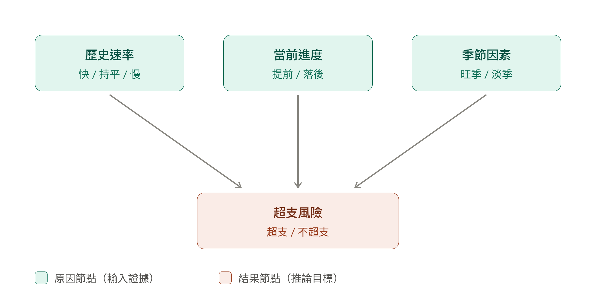

# Day 3 貝氏網路核心

核心實作位於 `src/budgetlens/bayesian.py`，使用 pgmpy 的離散貝氏網路與 Variable Elimination。

## 網路結構

`歷史速率`、`當前進度`、`季節因素` 是根節點，三者共同指向 `超支風險`。離散狀態與條件機率分數沿用原 Day 3 模型規格。



完整證據時，模型使用該狀態組合對應的條件機率；部分或沒有證據時，Variable Elimination 會依根節點先驗對未知狀態做邊際化，回傳 `P(超支風險=超支 | 證據)`。

## 暫定先驗

原始 Day 3 資料沒有定義根節點先驗，因此目前程式提供可替換的暫定值：

- 歷史速率（快、持平、慢）：`[0.25, 0.50, 0.25]`
- 當前進度（提前、落後）：`[0.50, 0.50]`
- 季節因素（旺季、淡季）：`[0.30, 0.70]`

這些是示範假設，不是從企業歷史資料估計出的參數；在正式展示或簡報中應標為假設，並由團隊確認或以資料校準。

## 使用方式

```python
from budgetlens.bayesian import posterior_overrun_probability, risk_report

evidence = {
    "歷史速率": "快",
    "當前進度": "提前",
    "季節因素": "旺季",
}
probability = posterior_overrun_probability(evidence)
print(probability)  # 0.95，亦即 95% 超支機率
print(risk_report(evidence))
```

也可只提供部分觀測，例如 `{"當前進度": "提前"}`；未提供的原因會依先驗機率邊際化。可透過 `priors` 參數覆寫先驗，值的順序須與狀態清單一致。

## 超支反向推論

觀察到超支後，`infer_overrun_causes()` 會對各原因節點計算 `P(原因狀態 | 超支)`，並比較該狀態下的超支率與模型基準超支率。各原因依超支率提升幅度排序；排序結果是模型依目前假設推論出的可能原因，不代表已由企業資料證實的因果關係。

```python
from budgetlens import infer_overrun_causes

report = infer_overrun_causes()
print(report["primary_cause"])
print(report["ranked_causes"])
```

依目前暫定先驗與 CPT，最高風險提升通常是「當前進度：提前」。若改動先驗、CPT 權重或補入實際觀測，排序也可能改變。

## 連續值離散化

- `hist_rate_state(last_year_actual, last_year_budget)`：去年實際/預算大於 1.05 為「快」，小於 0.95 為「慢」，其餘為「持平」。
- `progress_state(used_ratio, month)`：累計使用率高於已過月份比例為「提前」，否則為「落後」。
- `season_state(own_mult, industry_mult)`：沿用 Day 3 的 0.4/0.6 權重與 1.5 門檻。

這些門檻與 CPT 權重目前是原型參數，尚未透過歷史資料訓練或校準。
